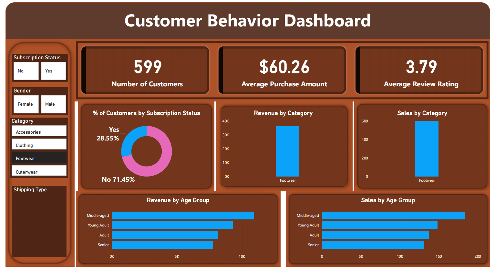

# 🛍️ Customer Shopping Behavior Analysis Dashboard

<p align="center">
  
</p>

<p align="center">
  
  
  
  
</p>

---

## 📌 Project Overview

Customer behavior analysis is essential for understanding purchasing patterns, customer preferences, and revenue-driving factors.

This project leverages **Python, SQL, and Power BI** to analyze customer shopping behavior and transform raw transactional data into meaningful business insights.

### 🎯 Objectives

* Analyze customer demographics and purchasing trends.
* Identify high-performing product categories.
* Evaluate the impact of subscription programs.
* Understand revenue contribution by age groups.
* Build an interactive dashboard for business decision-making.

---

## 🏗️ Project Workflow

```text
Raw Customer Dataset
        │
        ▼
Data Cleaning & Preprocessing
        │
        ▼
Exploratory Data Analysis (Python)
        │
        ▼
SQL Business Analysis
        │
        ▼
Power BI Dashboard Development
        │
        ▼
Business Insights & Recommendations
```

---

## 🛠️ Tools & Technologies

| Tool                | Purpose                  |
| ------------------- | ------------------------ |
| 🐍 Python           | Data Cleaning & Analysis |
| 📊 Pandas           | Data Manipulation        |
| 🔢 NumPy            | Numerical Operations     |
| 📈 Matplotlib       | Visualization            |
| 📉 Seaborn          | Statistical Charts       |
| 🗄️ SQL             | Business Queries         |
| ⚡ Power BI          | Dashboard Development    |
| 📓 Jupyter Notebook | Analysis Environment     |

---

## 📂 Repository Structure

```text
Customer-Shopping-Behavior
│
├── Business Problem Document.pdf
├── Customer Shopping Behavior Analysis.pdf
├── Customer-Shopping-Behavior-Analysis.pptx
├── Customer_Shopping_Behavior_Analysis.ipynb
├── customer_behavior_dashboard.pbix
├── customer_behavior_sql_queries.sql
├── customer_shopping_behavior.csv
├── images/
│   └── dashboard-overview.png
└── README.md
```

---

## 📊 Dataset Features

| Feature                | Description                |
| ---------------------- | -------------------------- |
| Customer ID            | Unique customer identifier |
| Age                    | Customer age               |
| Gender                 | Male / Female              |
| Category               | Product category purchased |
| Purchase Amount        | Amount spent by customer   |
| Subscription Status    | Membership status          |
| Review Rating          | Customer feedback score    |
| Shipping Type          | Delivery preference        |
| Frequency of Purchases | Shopping frequency         |

---

# 📈 Dashboard Highlights

## 🔹 Key Performance Indicators

| KPI                        | Value  |
| -------------------------- | ------ |
| 👥 Total Customers         | 599    |
| 💰 Average Purchase Amount | $60.26 |
| ⭐ Average Review Rating    | 3.79   |

---

## 🎛️ Interactive Dashboard Features

### Filters

* ✅ Subscription Status
* ✅ Gender
* ✅ Product Category
* ✅ Shipping Type

### Visualizations

* 📊 Customer Distribution by Subscription Status
* 💰 Revenue by Category
* 🛒 Sales by Category
* 👨‍👩‍👧 Revenue by Age Group
* 📈 Sales by Age Group

---

# 🔍 Key Business Insights

## 1️⃣ Subscription Adoption Opportunity

### Findings

* 71.45% customers are non-subscribers.
* Only 28.55% customers are subscribers.

### Business Impact

A large percentage of customers are not enrolled in membership programs, representing a significant opportunity for customer retention.

### Recommendation

* Launch loyalty programs.
* Offer subscriber-only discounts.
* Create reward-based memberships.

---

## 2️⃣ Footwear Category Drives Revenue

### Findings

Footwear emerged as one of the strongest-performing categories in terms of sales and revenue.

### Recommendation

* Increase inventory availability.
* Run seasonal footwear campaigns.
* Introduce bundle offers.

---

## 3️⃣ Middle-Aged Customers Generate Highest Revenue

### Findings

The Middle-Aged segment contributes the highest revenue and sales volume.

### Recommendation

Focus marketing efforts on this customer group through personalized promotions and premium offerings.

---

## 4️⃣ Young Adults Show Strong Engagement

### Findings

Young Adults represent the second most valuable customer segment.

### Recommendation

* Social media campaigns.
* Personalized recommendations.
* Mobile-first shopping experiences.

---

## 5️⃣ Customer Satisfaction Needs Improvement

### Findings

Average customer review rating:

⭐ **3.79 / 5**

### Recommendation

* Improve customer support.
* Enhance delivery efficiency.
* Improve product quality consistency.

---

# 🗄️ SQL Analysis

The project includes SQL-based business analysis for:

* Customer Segmentation
* Revenue Analysis
* Subscription Analysis
* Product Category Performance
* Purchase Behavior Analysis
* Customer Demographics Analysis

---

# 📑 Project Deliverables

| Deliverable                  | Description            |
| ---------------------------- | ---------------------- |
| 📄 Business Problem Document | Business Understanding |
| 📓 Jupyter Notebook          | Data Analysis          |
| 🗄️ SQL Queries              | Business Analysis      |
| 📊 Power BI Dashboard        | Interactive Dashboard  |
| 📑 PDF Report                | Final Analysis         |
| 🎤 PPT Presentation          | Project Presentation   |

---

# 🚀 Future Enhancements

* 🤖 Customer Segmentation using Machine Learning
* 📉 Customer Churn Prediction
* 🎯 Recommendation System
* 📈 Sales Forecasting
* 💎 Customer Lifetime Value (CLV) Analysis
* 🧠 Predictive Analytics Dashboard

---

# 🎯 Conclusion

This project demonstrates a complete end-to-end Data Analytics workflow using Python, SQL, and Power BI.

The dashboard provides valuable insights into customer purchasing behavior, product performance, customer demographics, and subscription trends, enabling businesses to make informed, data-driven decisions.

---

## 👨‍💻 Author

**Kaushal Kumar**

Aspiring Data Analyst | Python | SQL | Power BI | Data Visualization

⭐ If you found this project useful, consider giving it a star.
